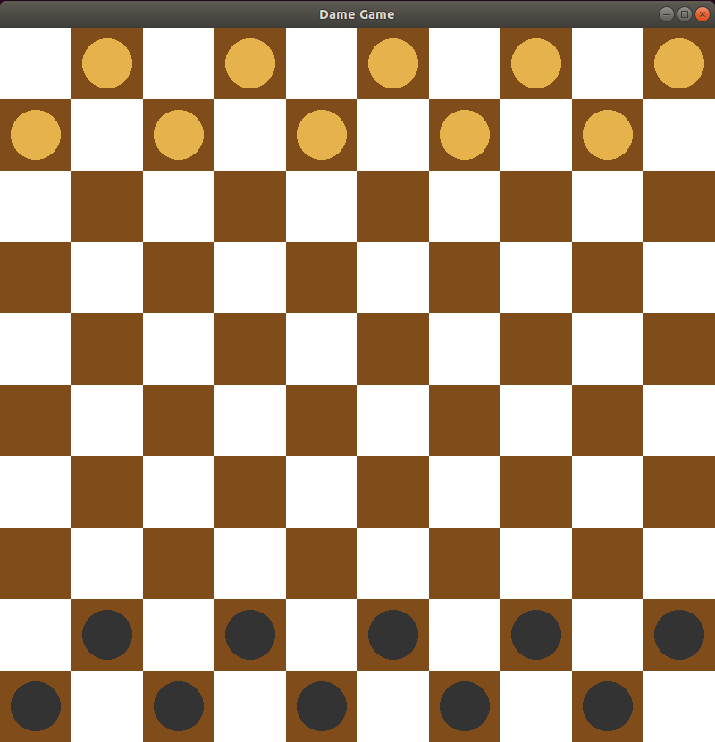
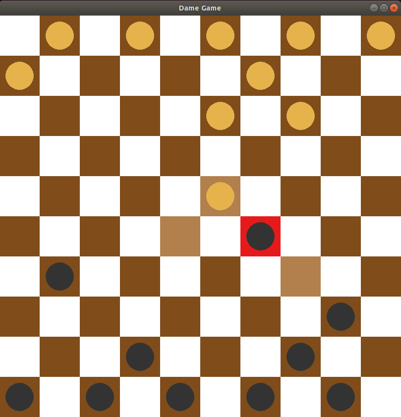
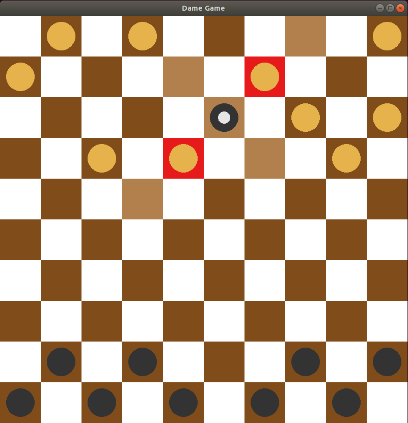

# Checkers 
<p align="center">

</p>
I made this game for no good reason, I was traveling and had no internet to download any cool game :p

## Cool features
<p align="center">

.....

</p>

- Move pieces
- Eat other pieces
- Movement hint
- Become king

Like any checkers. Fun!

## Installation
First, you need to download the OpenGl and Glut:
```
$ sudo apt-get install mesa-common-dev
$ sudo apt-get install freeglut3-dev

$ git clone https://github.com/Brenocq/Checkers.git
```

## Compilling and running
```
$ cd Checkers 
$ make clean
$ make

$ ./run
```
